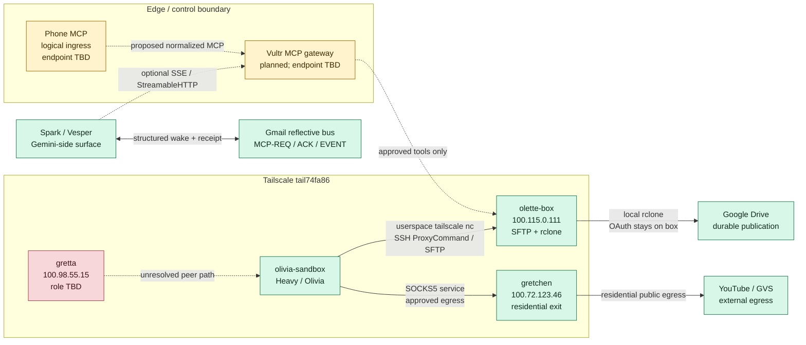
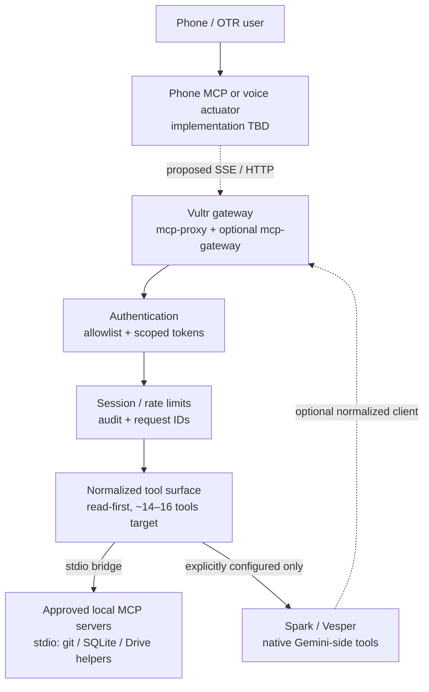
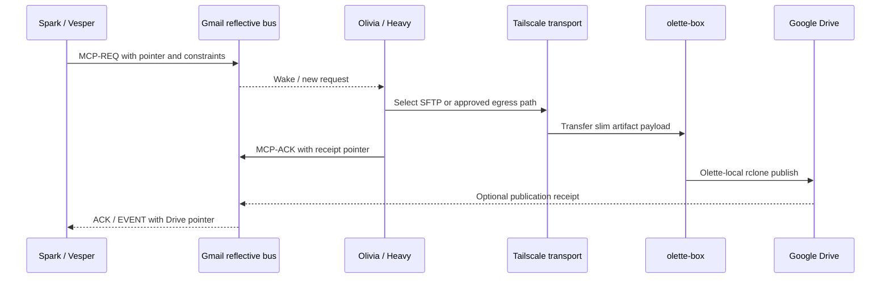
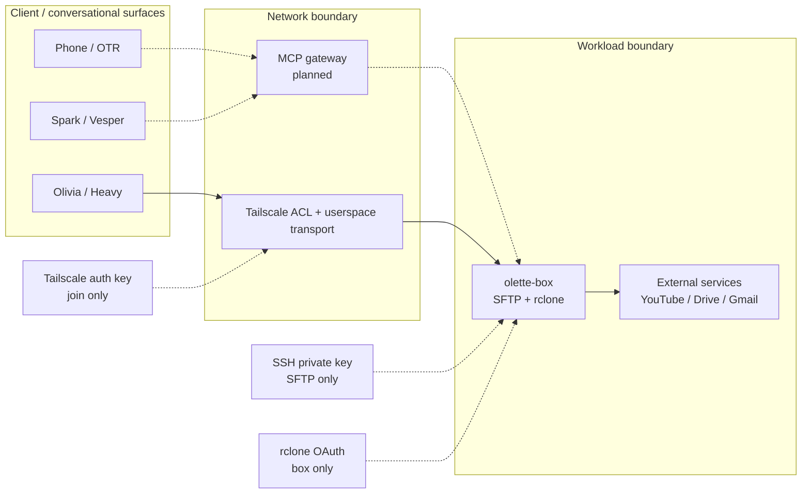

# Mesh topology

**Status:** architecture record  
**Last verified:** 2026-09-17  
**Scope:** Tailscale transport, artifact ferry, residential egress, MCP edge
broker, phone-facing control, and Gemini Spark/Vesper coordination.

This document is the topology map for the distributed surfaces around Liv HUB.
It deliberately separates facts proven by repository runbooks from operator-
supplied addresses and proposed components. A node being named here does not
mean that this checkout can currently reach it.

## Executive summary

The mesh has three different concerns:

1. **Data plane:** Heavy/Olivia produces artifacts, transfers a slimmed payload
   over the Tailscale userspace network to `olette-box`, and Olette publishes
   from that box to Google Drive with its local `rclone` credentials.
2. **Egress plane:** Gretchen is the documented residential exit path for
   YouTube/GVS traffic. It is not the SFTP destination and should not be used
   as a synonym for the artifact ferry.
3. **Control plane:** Gmail's reflective MCP bus, a future phone MCP surface,
   the proposed Vultr gateway, and Gemini Spark/Vesper provide wake-up,
   normalization, and coordination. The Vultr gateway and phone MCP are
   architectural boundaries, not proven live services in this repository.

The key design rule is **route by capability, not by node proximity**:
`olette-box` receives files, Gretchen provides approved residential egress,
the gateway normalizes MCP transport, and Spark handles its own Google-facing
surface.

## Node inventory

| Node / surface | Address or transport | Role | Evidence and status |
|---|---|---|---|
| `olette-box` | Tailscale `100.115.0.111`; `olette-box.tail74fa86.ts.net` | SFTP sink and Drive publication host | **Documented/proven.** SFTP user is `olivia`; port 22 is reached over Tailscale. |
| `gretchen` | Tailscale `100.72.123.46` | Residential/phone exit for YouTube/GVS egress | **Documented/proven.** The proof record identifies Windstream public egress; this is a different path from SFTP. |
| `gretta` | Tailscale `100.98.55.15` | Named mesh peer; operational role TBD | **Operator-supplied, not verified in repository.** Do not select it for routing until its role, ACLs, and liveness are confirmed. |
| `olivia-sandbox` | Tailscale client; a historical record lists `100.74.242.34` | Heavy/Olivia work surface and artifact producer | **Documented as a joining client.** Its address may change; userspace networking means the kernel does not directly route `100.x`. |
| Vultr gateway | Public endpoint not supplied | Proposed MCP edge broker | **Planned.** The design calls for `mcp-proxy`, optionally behind `mcp-gateway`; no live host, port, or deployment record is present here. |
| Phone MCP | Endpoint not supplied | Phone-friendly actuator/control ingress | **Logical boundary only.** No `phone-mcp` implementation or endpoint is present in this checkout. |
| Spark / Vesper | Gemini-side stdio or Google Workspace surface | Peer surface for Gmail, Keep, Drive, and the reflective bus | **Design surface.** Spark is not assumed to be a Tailscale node or a gateway client until configured. |
| Google Drive | Olette-local `rclone`; Google APIs/connectors | Durable publication/data store | **Proven as the destination** for the Heavy → Olette → Drive loop. It is not the low-latency control bus. |
| Gmail reflective bus | Subject-tagged email; JSON/YAML body | Durable wake-up and receipt channel | **Design captured and used as the preferred delayed-activation pattern.** It carries pointers and receipts, not heavy payloads. |

### Address hygiene

The `100.64.0.0/10` range is Tailscale CGNAT space. These addresses are
meaningful inside the tailnet and must not be documented as public service
endpoints. The topology intentionally does not record auth keys, SSH private
keys, OAuth refresh tokens, or gateway secrets.

## Topology map

The following view shows the intended boundaries. Solid edges are documented
paths; dashed edges are proposed or unresolved.



## Plane separation

### Data plane: artifact ferry

The proven artifact route is:

```text
Heavy/Olivia
  -> local generation and receipt files
  -> slim SFTP over Tailscale userspace
  -> olette-box:/workspace/sync/in/olivia-plates/
  -> Olette-local rclone
  -> new Google Drive folder
```

The sandbox uses userspace networking rather than a persistent TUN device.
Consequently, an ordinary kernel route to `100.115.0.111` is not the
connectivity test. The SFTP client must use Tailscale's `nc` as its
`ProxyCommand`:

```text
sftp -i ~/.ssh/olivia-sftp \
  -o IdentitiesOnly=yes \
  -o ProxyCommand="/tmp/tailscale --socket=/tmp/tailscaled.sock nc %h %p" \
  olivia@100.115.0.111
```

This command is a runbook pattern, not a credential example. The private key
must remain outside git and outside chat.

**Data-plane invariants**

- SFTP user: `olivia`, not `bunny`.
- Remote working directory: `/workspace/sync`.
- `in/olivia-plates/` is the handoff directory for slimmed JPG/JSON/Markdown
  payloads.
- Large source videos should not be pushed as a single recursive SFTP tree.
- Drive publication belongs to Olette-box so the `rclone` token stays there.
- Taildrop is a peer-to-peer blob ferry, not an interactive login or a
  replacement for the canonical SFTP handoff.

### Egress plane: Gretchen

Gretchen is a policy-selected exit path, not a general mesh router:

```text
Olivia sandbox
  -> Tailscale service / SOCKS5
  -> Gretchen 100.72.123.46
  -> residential public egress
  -> YouTube / GVS
```

The repository records that direct datacenter egress returned GVS 403 and that
HTTP CONNECT was unreliable, while SOCKS5 through Gretchen worked. That makes
the protocol choice part of the architecture:

- use SOCKS5 for the documented YouTube/GVS path;
- do not send SFTP through Gretchen;
- do not infer that `gretta` is a second exit node merely because it has a
  known Tailscale address;
- keep SOCKS/POT services bound to an approved local or tailnet interface,
  never `0.0.0.0`.

`DERP(tor)` is a relay state, not a failure state. It can explain slower
transfers, but it does not change the destination or authorize a new route.

### Control plane: wake, normalize, approve

The control plane is intentionally lighter than the data plane:

1. Spark or Olivia emits a small request or event.
2. Gmail carries a subject tag and a compact structured body.
3. A phone-friendly actuator may wake the workflow.
4. The proposed gateway exposes a small, authenticated MCP surface.
5. A tool call either returns a pointer/receipt or pauses for human approval.
6. Heavy bytes remain in Drive or the canonical local store.

Suggested message envelope:

```json
{
  "msg_id": "uuid",
  "from": "vesper",
  "to": "olivia-bridge",
  "type": "MCP-REQ",
  "action": "search_or_publish",
  "payload": {
    "pointer": "drive-or-sync-reference",
    "constraints": ["read-only"]
  },
  "reply_to_subject": "[MCP-ACK] <msg_id>"
}
```

The envelope is a contract sketch, not a claim that every producer currently
emits these exact fields.

## MCP edge and phone boundary

### Proposed Vultr gateway

Existing architecture notes identify Vultr as a possible deployment target for
an MCP proxy. The gateway should be treated as a narrow edge broker:



The gateway is not a permission bypass. Before deployment it needs:

- a concrete hostname and port inventory;
- inbound firewall rules limited to the intended clients;
- TLS and authentication ownership;
- per-tool authorization and rate limits;
- request IDs and an audit sink;
- an explicit list of tools allowed to reach `olette-box`;
- a human approval step for Drive writes, external sends, or other
  consequential actions.

Until those facts exist, the gateway remains a design target. The topology
must not invent a Vultr IP or imply that a public MCP endpoint is reachable.

### Phone MCP

“Phone MCP” is used here as the name of the phone-facing actuator boundary,
not as the name of a discovered package. The repository contains adjacent
designs for Pipecat voice (`STT -> LLM -> TTS`) and a Gmail event path, but no
verified phone MCP server, endpoint, or authentication contract.

The safe contract is therefore:

- the phone sends a small intent, status request, or approval;
- the actuator attaches a request ID and applies the same subject/tag or
  gateway schema as other clients;
- the gateway presents only the normalized, least-privilege tool set;
- heavy results return as pointers and receipts;
- actions with external side effects require explicit approval.

This keeps phone latency concerns in the control plane. It does not require
the phone to mount the tailnet, hold an SFTP key, or receive a Drive token.

## Spark / Vesper integration

Spark (Vesper) is a peer surface, not a hidden alias for any Tailscale host.
The documented distinction is:

| Surface | Native transport | Mesh implication |
|---|---|---|
| Grok / Olivia-side tools | SSE or StreamableHTTP | Can consume a normalized edge surface when explicitly configured. |
| Gemini / Spark | stdio or Gemini function declarations | Owns its local Google-facing connectors; does not automatically inherit tailnet access. |
| Shared coordination | Gmail tags + compact JSON/YAML | Crosses restarts and carries wake-up, pointers, and receipts. |

The preferred Spark handoff is pointer-first:



Spark should not be promised raw access to `olette-box`, the Tailscale
control socket, or the secrets used by either SFTP or `rclone`. If Spark later
needs a tool that lives on the mesh, expose that tool through the gateway after
its authorization and audit contract is reviewed.

## Trust boundaries and credential ownership



Credential rules:

- A Tailscale auth key authorizes tailnet joining; it is not an SSH key.
- The `olivia-sftp` private key authorizes SFTP; it does not join the
  tailnet.
- The `rclone` token and client secret stay on `olette-box`.
- No credential belongs in a Mermaid diagram, prompt, skill, work queue, or
  commit.
- Reuse the persisted Tailscale state when appropriate; do not mint a new
  auth key per conversation.

## Routing table

| Need | Source | Destination | Protocol/path | Decision |
|---|---|---|---|---|
| Move slim artifact payload | Olivia sandbox | `olette-box` | Tailscale userspace + `tailscale nc` + SFTP | **Use.** Canonical ferry. |
| Fetch YouTube/GVS bytes | Olivia sandbox | Internet via Gretchen | Tailscale service + SOCKS5 | **Use when approved.** Do not substitute HTTP CONNECT. |
| Publish to Drive | Olette process | Google Drive | Local `rclone` on `olette-box` | **Use.** Keep OAuth on the box. |
| Wake Spark or Olivia | Spark / Olivia | Peer actuator | Gmail reflective bus | **Use for small requests, pointers, ACKs, and receipts.** |
| Phone request to an MCP tool | Phone actuator | Vultr gateway | Proposed authenticated SSE/HTTP | **Future.** Endpoint and implementation must be recorded first. |
| Spark tool call to a mesh-local tool | Spark | Vultr gateway or approved local bridge | Proposed normalized MCP | **Future.** Requires explicit authorization. |
| Unknown peer `gretta` | Any client | `100.98.55.15` | Tailscale path TBD | **Hold.** Verify role, ACLs, and liveness before routing. |

## Failure modes and diagnosis

| Symptom | Likely interpretation | Safe response |
|---|---|---|
| Kernel cannot connect directly to `100.115.0.111` | Expected userspace networking limitation | Use the Tailscale socket and `nc` ProxyCommand; do not add an ad hoc public route. |
| SFTP is slow and reports `DERP(tor)` | Relay path is active but slower | Continue if the transfer is bounded; do not treat it as proof that Gretchen is in the path. |
| YouTube returns GVS 403 | Datacenter egress was rejected | Use the approved Gretchen SOCKS5 route; do not expose the proxy publicly. |
| HTTP CONNECT resets | Wrong proxy transport for the proven path | Use SOCKS5 where the runbook calls for it. |
| Drive folder exists but is incomplete | Olette-local `rclone` may still be copying | Check the receipt and remote contents; do not start a second copy. |
| Phone MCP cannot connect | No verified phone MCP endpoint is recorded | Check the actuator/gateway deployment record; do not guess a port or bypass auth. |
| `gretta` responds but role is unknown | Address alone does not confer capability | Treat it as an unresolved peer until ownership, ACLs, and service role are documented. |

## Verification checklist

Before calling this topology “live” for a new environment, record evidence for
each applicable item:

- [ ] Tailnet name and current `tailscale status` inventory.
- [ ] `olette-box` reachable through the userspace `tailscale nc` path.
- [ ] SFTP identity is `olivia`; no key material is copied into the repo.
- [ ] Gretchen SOCKS5 endpoint is bound narrowly and egress is approved.
- [ ] `gretta` role, ACLs, and liveness are known before use.
- [ ] Vultr hostname, port, TLS, auth owner, and firewall policy are recorded.
- [ ] Phone MCP implementation and request/approval contract are recorded.
- [ ] Spark handoff uses pointers/receipts rather than heavy email payloads.
- [ ] Gateway tool allowlist, audit sink, and human-approval policy are tested.
- [ ] Drive publication is performed by Olette-local `rclone`.

## Source records

The facts in this document are consolidated from:

- [`tailnet-ferry/SKILL.md`](../../skill_tree/skills/skill-orchestrator/references/integrations/tailnet-ferry/SKILL.md)
  — tailnet host card, userspace join, SFTP, Taildrop, DERP, and secret
  boundaries.
- [`heavy-olette-drive-pipe/RUNBOOK.md`](../../skill_tree/skills/skill-orchestrator/references/integrations/heavy-olette-drive-pipe/RUNBOOK.md)
  — Gretchen SOCKS5 flow, slim SFTP, and Olette-local publication.
- [`heavy-olette-drive-pipe/PROOF.md`](../../skill_tree/skills/skill-orchestrator/references/integrations/heavy-olette-drive-pipe/PROOF.md)
  — closed-loop evidence and known Tailscale addresses.
- [`01_MCP_NORMALIZATION_BRIDGE.md`](../../skill_tree/skills/system-roadmap/references/third-party-skills-eval-2026-08-17/01_MCP_NORMALIZATION_BRIDGE.md)
  — proposed proxy/gateway shape and Grok/Spark transport differences.
- [`01_Gmail_Fake_MCP_Bus.md`](../../skill_tree/skills/system-roadmap/references/io-normalization-recon-2026-08-16/01_Gmail_Fake_MCP_Bus.md)
  — reflective control-plane contract.
- [`03_VESPER_SKILL_OUTLINE.md`](../../skill_tree/skills/system-roadmap/references/circular-multi-surface-recovery-2026-08-16/03_VESPER_SKILL_OUTLINE.md)
  — Spark/Vesper’s intended Google-facing surfaces.

The addresses for `gretta`, and the request to include a phone MCP and Spark
in this topology, are operator inputs for this record. They are marked
unverified where the repository contains no corroborating implementation or
runbook.
